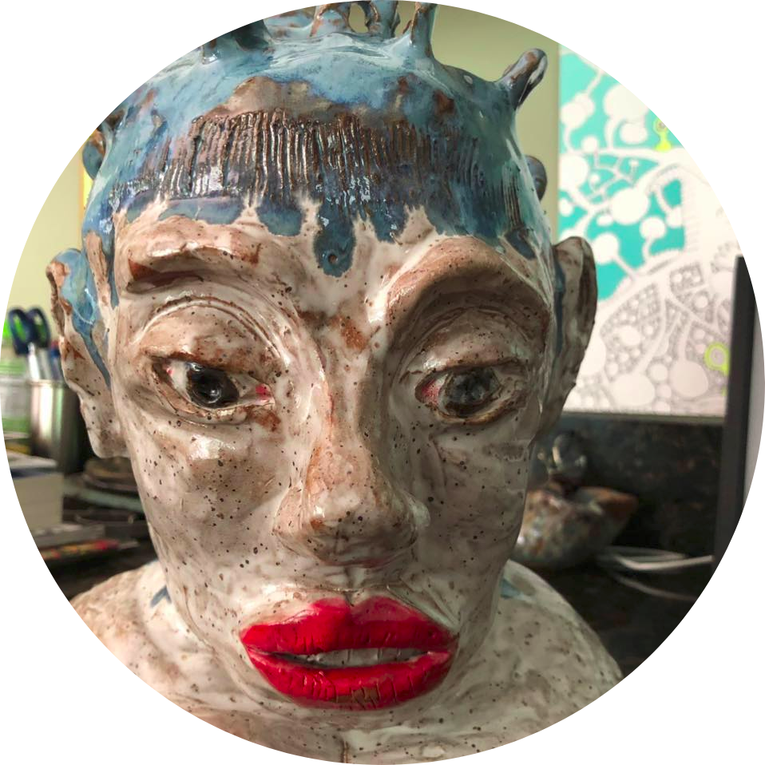

# Natacha Bot



The _natacha bot_ generates posts in the style of an individual, Natacha. It is derived from the [Trump bot](https://github.com/rtlee9/Trump-bot) using Facebook posts and comments using a [word-level RNN](https://github.com/larspars/word-rnn) and [pre-trained](http://nlp.stanford.edu/projects/glove/) GloVe word vectors. This repo corresponds to [this](https://eightportions.com/2016-11-03-Trump-bot/) Eight Portions blog post.

## Development

The following steps are what I did to generate the container and model. I don't
typically do this interactively, but since the training would take days I chose
this approach. First, I parsed raw data using [data/natacha/generate_input.py](data/natacha/generate_input.py).
I went through this after generating the file to still remove people's full names and
any address information.

Then I pull the base image that has python and dependencies installed.

```bash
$ docker pull rtlee/t-bot:sample
```

Run the container and bind the new [natacha](data/natacha) data directory.

```bash
docker run -it -v $PWD/data/natacha:/root/Trump-bot/data/natacha rtlee/t-bot:sample
```

Copy the script to train the natacha data:

```bash
cp data/natacha/train_*.sh .
```

And then run the training after updating the repository:

```bash
git pull origin master
./train_script.sh # I'm not sure if we need to run this
./train_words.sh
./train_char.sh
```

Identify the best word and character level models and move to `/cv/`, replacing the existing files corresponding to the appropriate model type.

```bash
cp cv_char/lm_lstm_epoch30.00_1.3580.t7 cv/char-rnn-trained.t7
cp cv_word_caps_256_2/lm_lstm_epoch40.00_4.4779.t7 cv/word-rnn-trained.t7
```

Then you can run the script to generate output!

```bash
python sample.py "I will build a"
```

When it was working to my liking, I could commit the current container to my local
machine to be able to push it to Docker Hub.

```bash
$ docker commit 49c6efad77dd vanessa/natacha-bot:latest
```

And then test running the container to generate new text.

```bash
$ docker run --rm -it vanessa/natacha-bot:latest python sample.py "I want to"

I want to be the power syndicate that they are the many with the profit present that she is a significant of the new the controlled profit since they are state the corruption of the state of the artist sender that is the organization and a corruption when it is a thing at the media many are they have the sen. Something can't go from your mind. I am not going to find the more again and not not sure that now isn't a but like a form of a break. If you will know the facts any of your evidence ? You can
```

Note that this shows manual generation of the model using the training container,
which is very large (~15GB). To distribute you likely want to use the multistage build, discussed next.

## Build

The included [Dockerfile](Dockerfile) can be used as a start for generating
the same image.

```bash
docker build -t vanessa/natacha-bot .
```

But then you likely want to build a smaller container using a multistage build to
just copy the finished models from cv, and then be done!

```bash
docker build -f Dockerfile.bot -t natacha-bot .
```

Note that I name it something different, even though ultimately I want to tag
it as vanessa/natacha-bot. I do this in case there is a mistake - I don't want
to lose the original container. You can then test:

```bash
docker run -it natacha-bot
```

And then tag the final container to save it!

```bash
docker tag natacha-bot vanessa/natacha-bot
```

## Credits, inspiration and similar projects

* The glorious, original [Trump-bot](https://github.com/rtlee9/Trump-bot).
* Lars Hiller Eidnes [word-rnn](https://github.com/larspars/word-rnn) based on Andrej Karpathy's [char-rnn](https://github.com/karpathy/char-rnn).
* [Auto-Generating Clickbait With Recurrent Neural Networks](https://larseidnes.com/2015/10/13/auto-generating-clickbait-with-recurrent-neural-networks/)
* [DeepDrumpf: Twitterbot](https://www.csail.mit.edu/deepdrumpf)
* [RoboTrumpDNN: Generating Donald Trump Speeches with Word2Vec and LSTM](https://github.com/ppramesi/RoboTrumpDNN)
